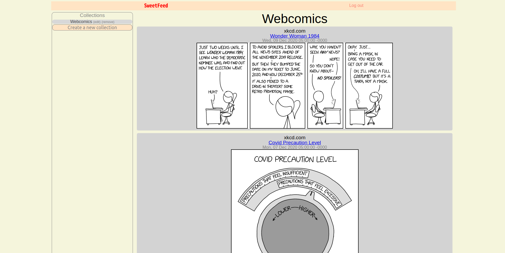
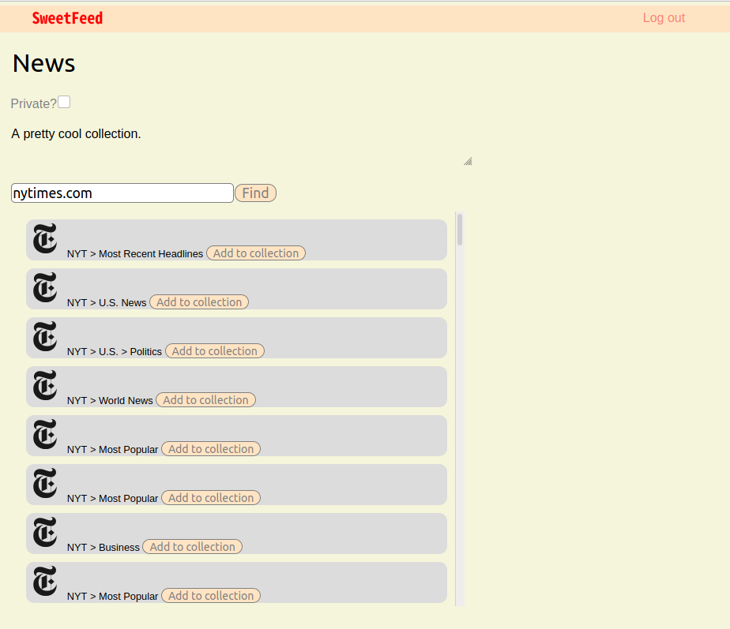

# SweetFeed
*By Ivan Roth - [Visit SweetFeed](http://sweetfeed.herokuapp.com/)*

**Table of Contents**
* [SweetFeed at a Glance](#sweetfeed-at-a-glance)
* [Application Architecture & Technologies Used](#application-architecture)
* [Frontend Overview](#frontend-overview)
* [Backend Overview](#backend-overview)
* [Conclusion & Next Steps](#conclusion-and-next-steps)

## SweetFeed at a Glance
SweetFeed is a full-stack web app that allows users to subscribe to RSS feeds and compile them into Collections which they can share with other users.

Users can search for feeds by url, and create collections which they can check in on for live updates from their favorite creators.

##### SweetFeed at a glance


SweetFeed locates RSS feeds for users by searching through a give top-level domain using the [FeedSearch API](https://feedsearch.dev). Users can then subscribe to those feeds by adding them to individual "collections", and each collection can then be viewed as a feed of recent posts, retrieved directly from their sources using the RSS protocol.

##### Feed search and collections


Users can create and delete "collections" of feeds, which are stored on the backend purely as lists of named feed URLs, linked to "collection" entries in the database which contain the information about the collection as a whole.

<!-- ## Application Architecture
...

(image)
 -->
## Frontend Overview
Sweetfeed uses an Express.js server on the frontend, with the React framework providing the interface. The frontend also interfaces with an external API to locate RSS feed URLs, via ``feedsearch.dev``.

### Frontend Technologies Used:
#### React
The frontend server is written in React.js, which allows the interface to behave responsively in the process of creating and viewing feed collections. The dynamic updating which is allowed by React is particularly useful in "view mode", when the user is accessing the display of recent posts in a particular collection: retrieving those posts from their respective hosts takes time, so this display is necessarily asynchronous, and React allows that to be handled smoothly without disrupting the user's experience.

### Feedsearch API
The interaction with the feedsearch.dev API occurs entirely on the frontend. When users enter a url into the search bar, their input is first sanitized. Specifically, prefixes like ``http://`` and ``https://`` are stripped out, because this string is going to be inserted directly into a feedsearch url, and forward slashes are liable to be mistaken for path separators. The code to sanitize this string and then make the fetch request too feedsearch.dev looks like this:

```
let cleanedURL = newFeed;
if (cleanedURL.includes('http:') || cleanedURL.includes('https:')) cleanedURL = cleanedURL.split('/').slice(2).join('/');
const searchRes = await fetch(`/feedsearch/${cleanedURL}`);
const resultsObj = await searchRes.json();
```

The ``resultsObj`` object, which was sent back by feedsearch.dev in JSON format, has an attribute called ``fields`` which contains an array of "feed" objects. The results list which shows up after searching a url is generated by directly mapping over this array: the array is stored in state, and then a "results" element that is already built into the page (but is hidden when there are no results in state) maps over that state variable to display the results, along with buttons to add the feed to the current collection, etc.

## Backend Overview
The backend server, written in Flask, does no significant processing, and mainly performs read/write functions with respect to the PostgreSQL database which stores user information as well as details on individual feeds and collections.

### Backend Technologies Used
#### Flask
The backend server is written in Python using Flask to interface with a PostgreSQL database. No major proccessing or interfacing with external APIs is accomplished on the backend server, so the primary tasks of the Flask backend server are formatting, storage, and retrieval of basic data fields in relation to users, feeds, and collections.

## Conclusion and Next Steps
In the future, I hope to expand the social features of the app, to allow for more searching and sharing of collections.

Thanks for reading! 🍓
